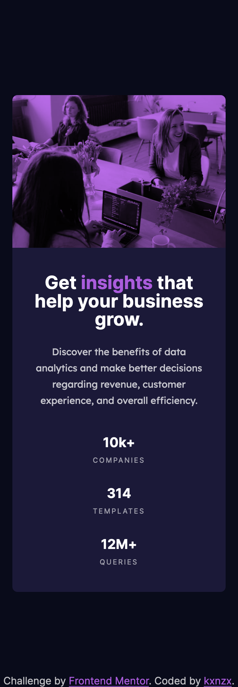

# Frontend Mentor - Stats Preview Card Component Solution

This is a solution to the [Stats Preview Card Component Challenge on Frontend Mentor](https://www.frontendmentor.io/challenges/stats-preview-card-component-8JqbgoU62). Frontend Mentor challenges help you improve your coding skills by building realistic projects.

## Table of contents

- [Overview](#overview)
  - [The challenge](#the-challenge)
  - [Screenshot](#screenshot)
  - [Links](#links)
- [My process](#my-process)
  - [Built with](#built-with)
  - [What I learned](#what-i-learned)
- [Author](#author)

## Overview

### The challenge

Users should be able to:

- View the optimal layout depending on their device's screen size

### Screenshot

#### Screensize 1440px - Desktop


#### Screensize 375px - Mobile



### Links

- View my Solution on [Frontend Mentor](https://your-solution-url.com)
- View the Live Site [here](https://your-live-site-url.com)

## My process

- HTML semantics
- Importing Google Fonts
- Set variables
- Reset default settings
- Styles (Mobile First)

### Built with

- Semantic HTML5 markup
- SASS custom properties
- CSS Grid
- CSS Flexbox
- Mobile-first workflow
- [Google Fonts](https://fonts.google.com/) - For Fonts

### What I learned

I have learned about "Relative File Paths":

For this project the banner image required a transparent color overlay. Initially, I placed the image in HTML. This however did not work very well when I began with the styling. The color overlay overflowed the height of the image and I was not able to correct it. Soon I figured out that there is an easier & efficient practice: I placed the image as a background-image property inside SCSS, but there was a problem...The image did not display on the browser. After some trial and error I realised that I used the wrong file path. After doing some research I gained some clarity. These are my notes:

- What is the difference between a folder and directory? A folder is a GUI object. Folders are essentially directories and directories hold files.

- It is important to note that the index.html always should be nested directly within the Root Directory, thus not in any subdirectories. You can visualize a Root Directory as a leader on top of a multi-level hierarchy structure with subdirectories below. When the Root Directory contains many nested subdirectories it resembles an upside down tree. The Root Directory (also named as the "Web Root"), is the publicly accessible base folder of a website. The Root Directory is marked by a / (slash) with Mac OS and Linux and a \ (backslash) with Windows.

Reminders when using "Relative File Paths":

- In which Directory is the file in which you're currently working on nested in?
  - The location of the file you want to link to is relative to the location of the file you want to link it from.
- If the file you want to link to is in the same Directory use:
  - ./
    - you can also just type "example.jpg"
- If the file you want to link to is outside your current working directory use:
  - ../
    - This means "leave the current folder and go to it's parent folder". The more ../../../ you use the further back you go.
- If you directly want to go to the Root Directory use:
  - /

The translation of the relative path below is: "go back to the Root Directory, then go to the folder Images, and then select the File image-header-mobile.jpg".

```SCSS

.card_image {
      background-image: url("/images/image-header-mobile.jpg");
      background-size: cover;
      height: 15rem;
      width: 100%;
      border-radius: 8px 8px 0 0;
      position: relative;
      @media screen and (min-width: $desktop) {
        background-image: url("/images/image-header-desktop.jpg");
        grid-column: 2/3;
        grid-row: 1/2;
        height: 100%;
        border-radius: 0 8px 8px 0;
      }
      .card_image-overlay {
        position: absolute;
        inset: 0;
        background: $overlay_clr;
        opacity: 0.75;
        mix-blend-mode: multiply;
      }
    }
```

## Author

- Frontend Mentor - [@kxnzx](https://www.frontendmentor.io/profile/kxnzx)
